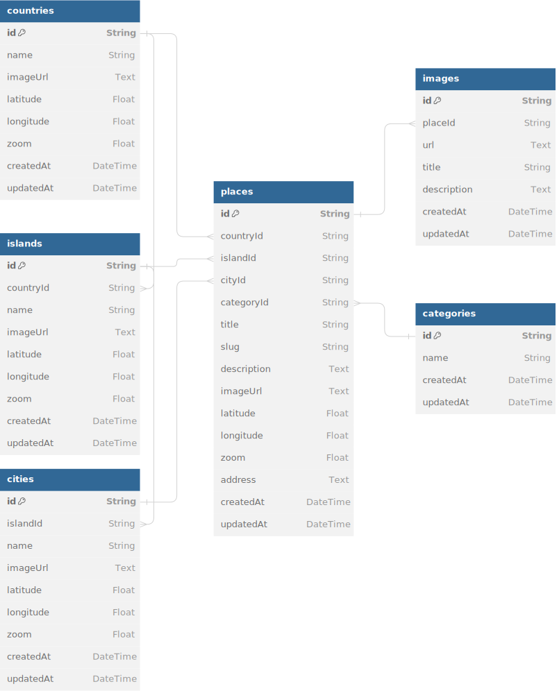

# Nusaventure Backend

Nusaventure REST API is a web service that provides access to a large collection of data on places to travel around the archipelago. It allows users to search for places, retrieve place details, and perform various operations related to tourist attractions, restaurants, etc.

## REST API Specification

- Production: `https://nusaventure-backend.onrender.com/`
- Local: `http://localhost:3000`

Nusaventure:

| Endpoint        | HTTP  | Description                                                             |
| --------------- | ----- | ----------------------------------------------------------------------- |
| `/countries`    | `GET` | Get all countries. Filters: search by name                              |
| `/islands`      | `GET` | Get all islands. Filters: search by name, country id                    |
| `/cities`       | `GET` | Get all cities. Filters: search by name, country id, island id          |
| `/plans`        | `GET` | Get all user's plans                                                    |
| `/plans/:id`    | `GET` | Get detail user's plan                                                  |
| `/places`       | `GET` | Get all places. Filters: search by name, country id, island id, city id |
| `/places/:slug	` | `GET` | Get place by slug                                                       |

Auth:

| Endpoint         | HTTP     | Permission    |
| ---------------- | -------- | ------------- |
| `/auth/register` | `POST`   | Public        |
| `/auth/login`    | `POST`   | Public        |
| `/plans`         | `POST`   | Authenticated |
| `/plans/:id`     | `PATCH`  | Authenticated |
| `/plans/:id`     | `DELETE` | Authenticated |

## Tech Stack

- [Hono](https://hono.dev/) over [Bun](https://bun.sh/) runtime
- [Typescript](https://www.typescriptlang.org/)
- [Prisma ORM](https://www.prisma.io/)
- [PostgreSQL](https://www.postgresql.org/)
- [Oslo](https://www.npmjs.com/package/oslo)
- [Render](https://render.com/)
- [Neon](https://neon.tech/)

## API Specification

The OpenAPI Specification for the Nusaventure API offers a detailed description of the API's services. It can be accessed at the path `/api-spec`.

For a more interactive experience, you can use SwaggerUI. It provides a user-friendly interface for exploring and testing the API. You can access SwaggerUI at `/api`.

You can also access the following:

- OpenAPI Specification: https://nusaventure-backend.onrender.com/api-spec
- SwaggerUI: https://nusaventure-backend.onrender.com/api

## Database Design

To view the database design in more detail, you can navigate to the following link: [ERD](https://dbdiagram.io/d/nusaventure-668d500a9939893dae76b5a7)



## Getting Started

Set up `.env` by copying from `.env.example` for reference

```sh
cp .env.example .env
```

Install dependencies

```sh
bun install
```

Run DB migration

```sh
bun run migrate:dev
```

Then you can run

```sh
bun run dev
```

Afterwards, open your browser and navigate to http://localhost:3000 to start exploring the API.
